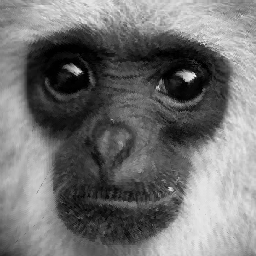
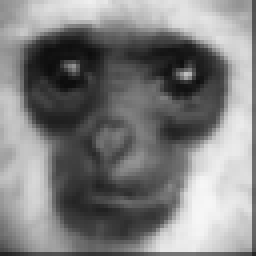
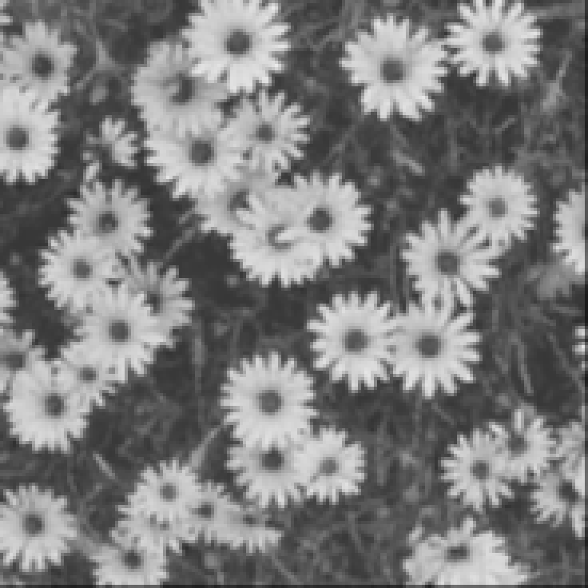

# Fractal compression algorithm

При написании алгоритма использовались статьи:
>https://habr.com/ru/articles/479200/

>https://habr.com/ru/articles/126653/

Второй способ(ultra_mega_hard) подразумевает сохранение исходных блоков, а не только коэффициентов, с посследующим рисованием этих блоков. В идеале нужно чтобы они хранились без повторений.

# Examples

1. 
   
    

2. 
   
    